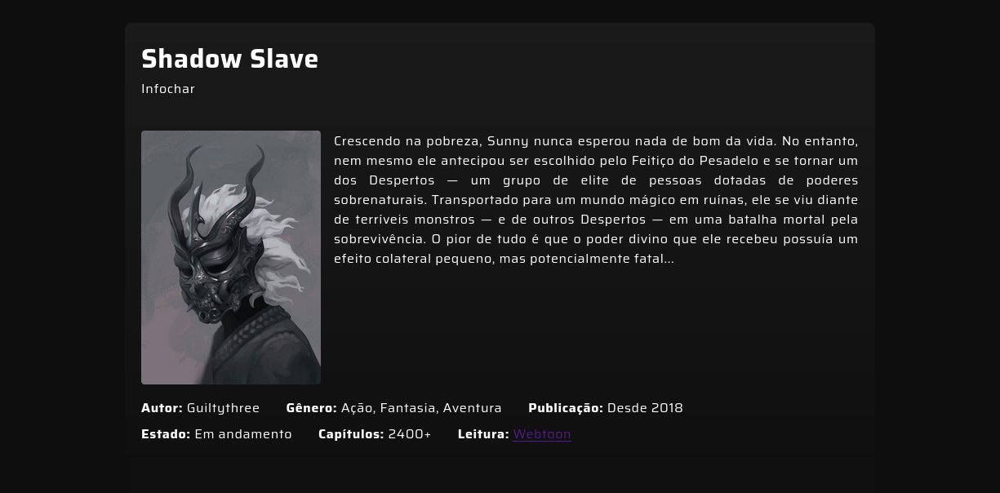
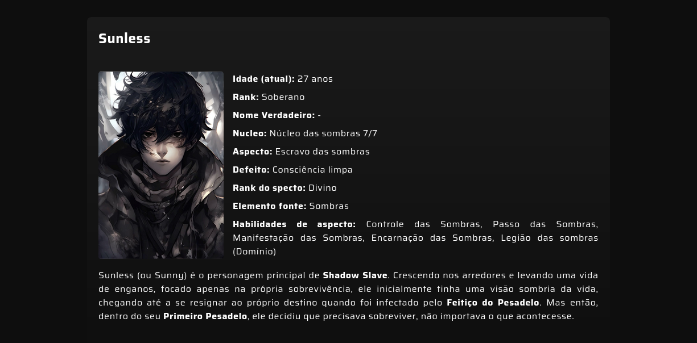

# Shadow Slave - Infochar

  
  
  

 

    
   

## Link do projeto

[Shado Slave - Infochar](https://shadow-slave-character-info.netlify.app/)

## Objetivo

Desenvolver uma aplicação web que englobe HTML, CSS e JS para praticar os conceitos desenvolvidos durante o curso CodeStart do Full Stack Club, além de aplicar conceitos como clean code e DRY.

## Funcionalidades

- **Slide-in:** Cards com carregamento animado para trazer maior nível de personalização;
- **DRY:** JavaScript construido testando a aplicação do conceito DRY (**D**on't **R**epeat **Y**ourself);
- **Responsividade:** Aplicação desenvolvida para empregar o conceito de responsividade, adaptavel para desktop e mobile.;

## Roadmap

- [ ] Adicionar mais informações;
- [ ] Menu de navegação para subdividir os assuntos (personagens, locais, sistemas, etc)

## Lições aprendidas

O objetivo desse projeto foi fortalecer minha base de conhecimento em HTML, CSS e JS puro. Dito isso, pude observar a progressão do meu entendimento, não apenas na estrutura HTML e CSS como também na construção da lógica das interações (JS) que sempre foi um desafio maior. Mas, acima de tudo, pude ver possíveis pontos de melhorias no quesito de aplicabilidade de conceitos como arquitetura de pastas, clean code e DRY. Sendo os dois ultimos, consegui, até certo ponto, aplica-los.

## Responsável pelo Projeto

[Guilherme Bueno](https://github.com/Guilherme-Bueno-Costa)  
